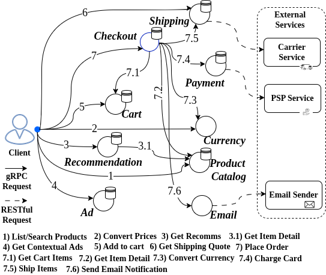

# Agentification (Architecture Refactoring) of Microservice Systems To LLM-Based Agentic-AI Systems

## Microservice System Benchmark:


- **[*Google Online Boutique Microservices (B1)](https://github.com/GoogleCloudPlatform/microservices-demo)** (ms_baseline/google_ms)
  
   

------------------


## AI Agents Implementation:

All AI agents are implemented using Python, Langgraph framework, and communicating via Ollama server via API (local in our setup but can modified to a remote server) to use open sources LLMs, while can also use major AI vendors by API key (e.g., gemini, claude, openAI).

For each microservice in each benchmark, an equivalent AI agent is implemented with the same database technology, DDD entities, communication interface (e.g., RESTful APIs, gRPC or thrift) are used for agents, and only the static functionality and logic of services converted as dynamic reasoning. Hence, the AI agents are pluggable in the system, so each component in the benchmarks can deployed either as service or AI agent.

- **Google Online Boutique Microservices** (original microservice code: microservice folder, AI agents implementation: multi_agent folder)

----------------------------

# Prerequisite

## Run Ollama server (locally / remote server) 
### (Needs a GPU node with at least 8GB of memory for small 3b model)

The ollama server should be installed first, then ready to be started (with inference optimization) and pull open sourced models:

```bash
    # configuration for inference optimization (required for maximum throughput and memory usage efficiency)
    setenv OLLAMA_FLASH_ATTENTION 1 # Enables Flash Attention on modern GPUs
    setenv OLLAMA_KV_CACHE_TYPE q4_0 # Compresses the KV cache with lower quantization
    setenv OLLAMA_KEEP_ALIVE 2h # keeps the model for 2h, eliminating "cold start" for subsequent requests.
    setenv OLLAMA_NUM_PARALLEL 100 # Defines how many simultaneous requests a single model will process.

    # start server
    systemctl start ollama
    ollama pull llama3.2:3b  # recommended
    ollama pull llama3:8b
    ollama pull qwen3:14b

    # warm up (load the model in memory)
    ollama run llama3.2:3b "Explain CAP theorem in 3 sentences."
    ollama run llama3:8b "Explain CAP theorem in 3 sentences."
    ollama run qwen3:14b "Explain CAP theorem in 3 sentences."
```

## Run local dockerized database and redis

- MongoDB: 
    ``` bash
    docker compose up -d mongodb
    ```

- Redis: 
    ``` bash
    docker compose up -d redis
    ```

**Check default user/password/db_name that set here in codes respectively, thereafter.**

----------------------------


# Deploy Architectures (Microservice or Hybrid with agents) and Run Experiments

There is a **deploy-local.sh** script in the deploy_orchestration folder, which receives the list of service (with ports) and agents to deploy each component as service or AI agent.  

## Deployment of microservice baseline and gather metrics

1-  **Google Online Boutique Microservices**

```bash
    cd local_deploy_orchestration/google_ms
    
    ./deploy-local.sh services=ad_service:5057,cart_service:5054,checkout_service:5050,currency_service:5053,email_service:5056,payment_service:5052,product_catalog_service:5055,recommendation_service:5058,shipping_service:5051 agents=

    # 2. Evaluate with workload and gather metrics
    python3 -m microservice.exp_runner
    
    # the full evaluation results will be gathered in ms_baseline/google_ms/results folder.
```


-----------------------------
